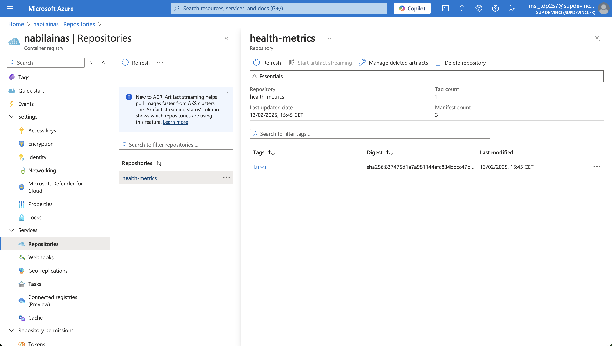
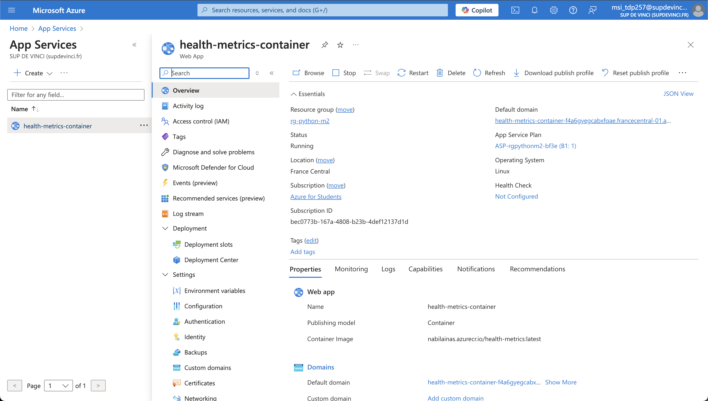
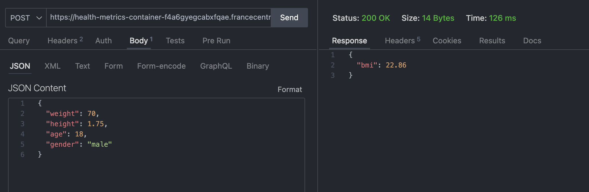

# Déploiement d'un microservice

# Avant propos

Dans ce petit projet nous avons créer un microservice, nous allons le gérer avec un make file et un docker file, puis on va le déployer sur azure app service

# Preuve

Dans un premier temps on va déployer un resource group et un container registry



Dans un second temps on va déployer l'app service après avoir push l'image avec la commande:

```bash
make push
```



Maintenant on peut tester les commandes avec thunderclient à cette adresse:
```bash
https://health-metrics-container-f4a6gyegcabxfqae.francecentral-01.azurewebsites.net/bmi
https://health-metrics-container-f4a6gyegcabxfqae.francecentral-01.azurewebsites.net/bmr
```

avec ce body:
```json
{
  "weight": 70,
  "height": 1.75,
  "age": 18,
  "gender": "male"
}
```

